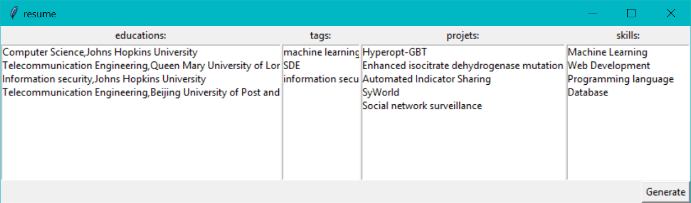

General idea and user case:
Applicants have to change their resume base one different JDs, i.e. changing project experience, job experience and skill set.
Sometimes, they need to change their detailed highlight in work/project experience, in order to match the tech stack in the JD.

Note: change conf/local.ini Name to your own name that match the json record.
The Mongodb should be installed and up running(host and port should be specified.)

The builder will
1. Collect work and project experiences in the a Mongodb database.To do this, run updateDB.py script, the input sample is provided in resume.json. The json schema should follow https://jsonresume.org/schema/  in general. But project items should have 'tag' array field indicating what roles or keyword the projects associated with.
2. Allow user to choose project/work experiences that match the roles(machine learning Engineer, full stack, SRE, SDE, information security). Run resume_builder.bat on windows to get in the GUI app.
3. Generate tex and pdf file on click generate button if running on windows(need miktex installed and added to path). Otherwise only generate tex file.
4. Replace certain category of keywords to the matching tech stack, e.g. [Flask<-->Django], [AngularJS<-->ReactJS].(Work in progress)
